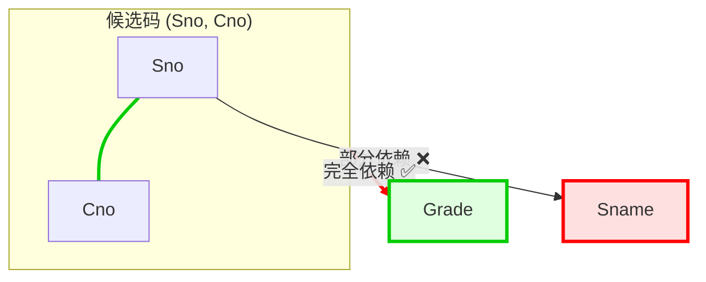
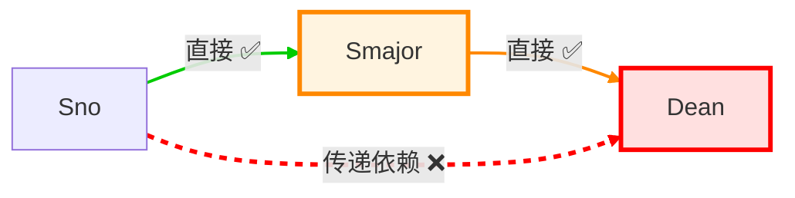
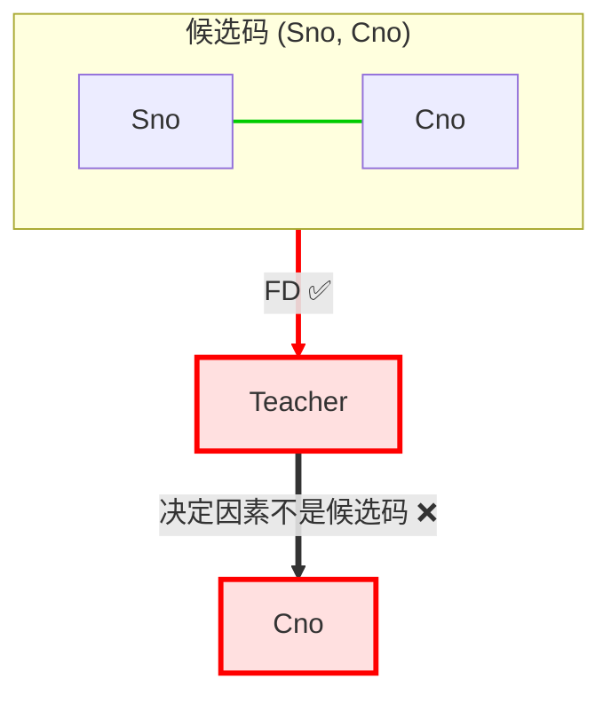

# 系统概述

## 基本概念

### 数据 data
描述事物的符号记录称为数据
数据的含义称为数据的语义，数据与其语义是不可分的

### 数据库 database DB
长期存储在计算机内有组织、可共享的大量数据的集合

### 数据库管理系统
位于用户与操作系统之间的数据管理软件，是计算机基础软件

### 数据库系统 DBS
引入数据库后的计算机系统，由数据库、数据库管理系统、应用系统和数据库管理员组成的

## 数据模型

### 概念模型

#### 基本概念

1. 实体(entity)：客观存在并可相互区别的事物
2. 属性(attribute)：实体所具有的特性
3. 码(key)：唯一标识实体的属性集
4. 实体类型(entity type)：同类实体的实体名及其属性名集合
5. 实体集(entity set)：同一类型实体的集合
6. 联系(relationship)：实体内部的联系（各属性的联系）和实体之间的联系（不同实体集的联系）

#### 实体-联系模型 E-R模型
实体用矩形、属性用椭圆、联系用菱形
将实体-属性、实体-联系-实体连线
在联系两侧标注基数：
- 一对一：1:1
- 一对多：1:N
- 多对多：Ｍ:N

### 数据模型三要素

#### 数据结构
描述数据库的组成对象以及对象之间的联系
是所描述的对象类型的集合
#### 数据操纵
对数据库中对象的实例的操作的集合，包括操作和操作规则
主要有查询、更新（插入、删除、修改）两类
数据模型必须定义操作的含义、符号、规则、语言
#### 完整性约束
一组完整性规则，规定数据及其联系的制约和依存

### 层次模型
#### 数据结构
实体用数据表示，实体的属性对应记录的字段
层次模型满足以下两个条件：
1. 有且只有一个节点没有双亲节点，该节点称为根节点
2. 根以外的所有节点有且只有一个双亲节点
每个节点表示一个记录类型，节点之间的连线表示记录之间的联系，这是双亲节点与子女节点的一对多的联系

#### 数据操纵与完整性约束
插入时，没有相应的双亲结点值就不能插入子女节点值
删除时，相应子女节点值也要一并删除

### 网状模型

#### 数据结构
满足以下两个条件：
1. 允许一个以上的节点没有双亲结点
2. 一个节点可以有多于一个的双亲结点
由于节点间的连线不唯一，需要对实体间的关系命名


### 关系模型

#### 数据结构


| 学号 (Sno) | 姓名 (Sname) | 性别 (Ssex) | 出生日期 (Sbirthdate) | 主修专业 (Smajor) |
|------------|--------------|-------------|------------------------|-------------------|
| 20180001   | 李勇         | 男          | 2000-3-8               | 信息安全          |
| 20180002   | 刘晨         | 女          | 1999-9-1               | 计算机科学与技术  |
| 20180003   | 王敏         | 女          | 2001-8-1               | 计算机科学与技术  |
| 20180004   | 张立         | 男          | 2000-1-8               | 计算机科学与技术  |
| 20180005   | 陈新奇       | 男          | 2001-11-1              | 信息管理与信息系统|
| 20180006   | 赵明         | 男          | 2000-6-12              | 数据科学与大数据技术 |
| 20180007   | 王佳佳       | 女          | 2001-12-7              | 数据科学与大数据技术 |

1. **关系（relation）**  
   一个关系对应通常说的一张二维表，如表1.2所示。

2. **元组（tuple）**  
   表中的一行即为一个元组。

3. **属性（attribute）**  
   表中的一列即为一个属性，每列的名称即为属性名。  
   如表1.2中共有5列，对应5个属性（学号、姓名、性别、出生日期、主修专业）。

4. **码（key）**  
   又称码键或键，是表中的某一个属性或一组属性，其值可以唯一确定一个元组。  
   如表1.2中的属性“学号”可以唯一确定一个学生，该属性也就成为本关系的码。

5. **域（domain）**  
   在表1.2中，域表示某一属性的取值范围。  
   例如，属性“性别”的域是（男，女），“主修专业”的域是学生所在学院所有专业名称的集合。

6. **分量（component）**  
   元组中的一个属性值。  
   例如，表1.2中的“李勇”即为元组（20180001, 李勇, 男, 2000-3-8, 信息安全）的一个分量。

7. **关系模式（relation schema）**  
   对关系的描述，一般表示为：  
   `关系名(属性1, 属性2, ..., 属性n)`  
   例如，表1.2的关系可描述为：  
   `学生(学号, 姓名, 性别, 出生日期, 主修专业)`


关系模型要求关系必须是规范化（normalization）的，即要求关系必须满足一定的规范条件。  
这些规范条件中最基本的一条是：

> 关系的每一个分量必须是一个不可分的数据项（原子值）

也就是说，不允许表中还有“表”。例如，“联系方式”如果可以再拆分，就不符合该要求。

## 模式结构

模式是数据逻辑特征和结构的描述，模式的一个具体值称为模式的实例
### 三级模式结构
1. 模式
模式是所有用户的公共数据视图，是数据库系统模式结构的中间层
一个数据库对应一个模式，模式以某一种数据模型为基础，定义数据的逻辑结构与联系、安全性完整性要求

2. 外模式
外模式是数据库用户能够看见和使用的局部数据的描述，是与某一应用有关的数据的逻辑视图
一个数据库可以有多个外模式，用户的需求不同，其外模式描述就不同

3. 内模式
一个数据库只有一个内模式，他是对物理结构和存储方式的描述，是数据在数据库内部的组织方式
例如记录的存储方式、索引方式、是否加密

### 两极映像与数据独立性

1. 外模式/模式映像
定义外模式与模式的对应关系，当模式改变时，由数据库管理员对映像做改变，可以保持外模式不变，保证了数据与程序的**逻辑独立性**

2. 模式/内模式映像
定义数据的逻辑结构与存储结构的对应关系，当存储结构改变时，对映像做改变，可以保持模式不变，保证了数据与程序的**物理独立性**

# 关系模型

## 数据结构与形式化定义

### 关系

#### 定义
**定义** **域**是一组具有相同数据类型的值的集合

**定义** **笛卡尔积**是域上的集合运算，给定一组域$D_1,D_2,...,D_n$，其笛卡尔积为$$\large D_1\times D_2\times\cdots\times D_n=\{(d_1,d_2,...,d_n)|d_i\in D_i,i=1,2,...,n\}$$
其中$(d_1,...,d_n)$称为n元组，简称**元组**，元组中的每一个值称为**分量**
笛卡尔积可以表示为一张二维表，表中每行对应一个元组，每列来自一个域

一般来说笛卡尔积的某个真子集才有实际含义

**定义** 给定一组域（允许相同），其笛卡尔积$D_1\times D_2\times\cdots\times D_n$的子集称为这组域上的**关系**，表示为
$$\large R(D_1,D_2,...,D_n)$$
其中$R$为关系名，$n$是关系的**目**或**度**
$n=1$称为一元关系，$n=2$称为二元关系
关系中的元素是关系中的元组，一般用$t$表示
此外，在数据库中对关系做如下限定和补充：
- 关系模型中的关系必须是**有限集合**
- 通过对每个列附加属性名的方法，取消属性的有序性，即**列次序可以任意交换**

#### 性质
1. 每一列的分量类型相同，来自同一个域
2. 不同列可以来自同一个域，但要给予不同的属性名
3. 列的次序可以任意交换
4. 任意两个元组的码不能相同
5. 行的次序可以任意交换
6. 每个分量必须不可再分

### 关系模式
**定义** 关系的描述称为**关系模式**，表示为
$$\large R(U,D,DOM,F)$$
其中$R$为关系名，$U$为属性名集合，$D$为属性来自的域，$DOM$为属性向域的映射集合，$F$为属性间依赖关系的集合

关系模式常简记为
$$\large R(A_1,...,A_n)$$
其中$A_i$为属性名，域名及属性向域的映射说明为属性的类型、长度

若某一属性或一组属性的值能唯一表示一个元组，且其真子集不能唯一标识，则该属性或属性组称为**候选码**
若一个关系有多个候选码，则选定其中一个为**主码**或**主键**，在关系中用下划线标注
候选码中的属性称为**主属性**，不在候选码中的属性称为**非主属性**。极端情况下关系模式的所有属性是候选码，称为**全码**

### 关系数据库

关系数据库中，实体、实体间的联系都是用关系来表示的，例如：
$$\large 学生实体Student(\underline{Sno},Sname,Ssex,Sbirthdate,Smajor)$$
$$\large 课程实体Course(\underline{Cno},Cname,Ccredit,Cpno)$$
$$\large 学生选课联系SC(\underline{Sno,Cno},Grade,Semester,Teachingclass)$$
## 关系操作

### 基本关系操作
查询：选择、投影、并、差、笛卡尔积
更新：插入、删除、修改

### 关系的完整性
#### 实体完整性
若属性$A$是关系$R$的主属性，则$A$不能为空值

#### 参照完整性
**定义** 设$F$是基本关系$R$的属性（非码），$K_S$是基本关系$S$的主码。如果$F$与$K_S$相对应，则称$F$为$R$的**外码**，称基本关系$R$为**参照关系**，$S$为**被参照关系**。$R,S$可以相同。

如果$F$是关系$R$的外码，他与$S$的主码$K_S$相对应，则对$R$在$F$上的每个值必须：
1. 或者取空值
2. 或者等于$S$中某个元组的主码值

参照完整性约束的是具有联系的属性必须取自相同的域

#### 用户定义的完整性
不同应用场景下特殊的约束

### 关系代数
<div align="center">
  <p><b>关系代数运算符</b></p>
  <table border="1" cellspacing="0" cellpadding="8" style="text-align: center;">
    <thead>
      <tr>
        <th colspan="2">运算符</th>
        <th>含义</th>
      </tr>
    </thead>
    <tbody>
      <tr>
        <td rowspan="4">集合<br>运算符</td>
        <td>∪</td>
        <td>并</td>
      </tr>
      <tr>
        <td>-</td>
        <td>差</td>
      </tr>
      <tr>
        <td>∩</td>
        <td>交</td>
      </tr>
      <tr>
        <td>×</td>
        <td>笛卡儿积</td>
      </tr>
      <tr>
        <td rowspan="4">专门的<br>关系<br>运算符</td>
        <td>σ</td>
        <td>选择</td>
      </tr>
      <tr>
        <td>Π</td>
        <td>投影</td>
      </tr>
      <tr>
        <td>⋈</td>
        <td>连接</td>
      </tr>
      <tr>
        <td>÷</td>
        <td>除</td>
      </tr>
    </tbody>
  </table>
</div>
#### 符号约定
- $t[A]$表示元组$t$在属性组$A$上的分量
- 象集：$Z_{x}=\{t[Z]|t\in R, t[X]=x\}$表示$R$中属性$X=x$的元组在$Z$上的分量集合
#### 集合运算
设关系$R,S$具有相同的目$n$（属性个数），且对应属性取自同一个域，$t$是元组变量
1. 并
$$\large R\cup S=\{t|t\in R\vee t\in S\}$$
2. 差$$\large R-S=\{t|t\in R\wedge t\notin S\}$$
3. 交$$\large R\cap S=\{t|t\in R\wedge t\in S\}$$
4. 笛卡尔积
设$R$为$n$目，$S$为$m$目，则$R\times S$有$m+n$列、$k_1\times k_2$个元组$$\large R\times S=\{\widehat{t_rt_s}|t_r\in R\wedge t_s\in S\}$$
#### 关系运算
##### 选择
$$\large \sigma_F(R)=\{t|t\in R\wedge F(t)='真'\}$$
$F$为选择条件，是一个逻辑表达式，选择给出$R$中符合条件的元组，例：
$$\large \sigma_{Smajor='信息安全'}(Student),\quad \sigma_{Sbirthday>=2001-1-1}(Student)$$
##### 投影
$$\large \Pi_A(R)=\{t[A]|t\in R\}$$
$A$为属性列，投影给出从$R$中选定属性（列）组成的新关系，例：
$$\large \Pi_{Sno,Smajor}(Student)$$
##### 连接
$$\large R\underset{A\theta B}{\bowtie}S=\{\widehat{t_rt_s}|t_r\in R\wedge t_s\in S\wedge t_r[A]\theta t_s[B]\}$$
$A,B$分别为$R,S$上列数相等且可比的属性列，$\theta$是比较运算符，连接运算从笛卡尔积$R\times S$中选取$R$在$A$上的值与$S$在$B$上的值满足关系$\theta$的元组

若$\theta='='$，则称为等值连接
自然连接是特别的等值连接，要求比较的分量是同名的属性列，并在结果中去除重复列，记作
$$\large R\bowtie S=\{\widehat{t_rt_s}[U-B]|t_r\in R\wedge t_s\in S\wedge t_r[B]=t_s[B]\}$$
在连接中被舍弃的元组称为**悬浮元组**，若在连接时保留（其他属性填NULL）则称为**外连接**，记作$R\unicode{x27d7}S$，只保留左边关系的悬浮元组称为**左外连接**$R\unicode{x27d5}S$，只保留右边的称为右外连接$R\unicode{x27d6}S$

##### 除
$$\large R\div S=\{t_r[X]|t_r\in R \wedge \Pi_Y(S)\subseteq Y_X\}$$
设$R$除$S$的结果为$T$，则$T$包含所有在$R$中但不在$S$中的属性和值，且$T$与$S$的元组的所有组合都在$R$中
![[关系除法.png]]

# 关系数据库标准语言SQL
## SQL概述

SQL（Structured Query Language，结构化查询语言）是用于管理和操作关系型数据库的标准语言。它是非过程化的，专注于**做什么**而非**怎么做**。

## 数据定义

<table border=1 style='margin: auto; word-wrap: break-word;'>
<tr>
<td rowspan="2" style='text-align: center; word-wrap: break-word;'>操作对象</td>
<td colspan="3" style='text-align: center; word-wrap: break-word;'>操作方式</td>
</tr>
<tr>
<td style='text-align: center; word-wrap: break-word;'>创建</td>
<td style='text-align: center; word-wrap: break-word;'>删除</td>
<td style='text-align: center; word-wrap: break-word;'>修改</td>
</tr>
<tr>
<td style='text-align: center; word-wrap: break-word;'>数据库模式</td>
<td style='text-align: center; word-wrap: break-word;'>CREATE SCHEMA</td>
<td style='text-align: center; word-wrap: break-word;'>DROP SCHEMA</td>
<td style='text-align: center; word-wrap: break-word;'>* SQL 标准无修改语句</td>
</tr>
<tr>
<td style='text-align: center; word-wrap: break-word;'>表</td>
<td style='text-align: center; word-wrap: break-word;'>CREATE TABLE</td>
<td style='text-align: center; word-wrap: break-word;'>DROP TABLE</td>
<td style='text-align: center; word-wrap: break-word;'>ALTER TABLE</td>
</tr>
<tr>
<td style='text-align: center; word-wrap: break-word;'>视图</td>
<td style='text-align: center; word-wrap: break-word;'>CREATE VIEW</td>
<td style='text-align: center; word-wrap: break-word;'>DROP VIEW</td>
<td style='text-align: center; word-wrap: break-word;'></td>
</tr>
<tr>
<td style='text-align: center; word-wrap: break-word;'>索引</td>
<td style='text-align: center; word-wrap: break-word;'>* CREATE INDEX</td>
<td style='text-align: center; word-wrap: break-word;'>* DROP INDEX</td>
<td style='text-align: center; word-wrap: break-word;'>* ALTER INDEX</td>
</tr>
</table>

### 创建数据库和模式
```sql
-- 创建数据库
CREATE DATABASE 数据库名;

-- 使用数据库
USE 数据库名;

-- 创建模式（可选，在某些DBMS中）
CREATE SCHEMA 模式名;
```

### 创建表
```sql
CREATE TABLE 表名 (
    列名 数据类型 [完整性约束],
    ...
    [表级完整性约束]
);
```
**示例**（基于学生表）：
```sql
CREATE TABLE Student (
    Sno CHAR(8) PRIMARY KEY,  -- 主键
    Sname CHAR(20) NOT NULL UNIQUE,
    Ssex CHAR(2),
    Sbirthday DATE,
    Smajor CHAR(20)
);
```

**常见数据类型**：

| 数据类型 | 含义 |
|---|---|
| CHAR(n), CHARACTER(n) | 长度为n的定长字符串 |
| VARCHAR(n), CHARACTERVARYING(n) | 最大长度为n的变长字符串 |
| CLOB | 字符串大对象 |
| BLOB | 二进制大对象 |
| INT, INTEGER | 整数(4字节)，取值范围是[-2 147 483 648, 2 147 483 647] |
| SMALLINT | 短整数(2字节)，取值范围是[-32 768, 32 767] |
| BIGINT | 大整数(8字节)，取值范围是[-2^63, 2^63-1] |
| NUMERIC(p, d) | 定点数，由p位数字（不包括符号、小数点）组成，小数点后面有d位数字 |
| DECIMAL(p, d), DEC(p, d) | 同NUMERIC类似，但数值精度不受p和d的限制 |
| REAL | 取决于机器精度的单精度浮点数 |
| DOUBLE PRECISION | 取决于机器精度的双精度浮点数 |
| FLOAT(n) | 可选精度的浮点数，精度至少为n位数字 |
| BOOLEAN | 逻辑布尔量 |
| DATE | 日期，包含年、月、日，格式为YYYY-MM-DD |
| TIME | 时间，包含一日的时、分、秒，格式为HH:MM:SS |
| TIMESTAMP | 时间戳类型 |
| INTERVAL | 时间间隔类型 |

**完整性约束**：
- `PRIMARY KEY`：主键，非空唯一。
- `FOREIGN KEY (列) REFERENCES 表(列)`：外键。
- `NOT NULL`：非空。
- `UNIQUE`：唯一。
- `DEFAULT 值`：默认值。
- `CHECK (条件)`：检查约束。

**表级约束示例**：
```sql
CREATE TABLE SC (
    Sno CHAR(8),
    Cno CHAR(4),
    Grade INT,
    PRIMARY KEY (Sno, Cno),  -- 复合主键
    FOREIGN KEY (Sno) REFERENCES Student(Sno),
    FOREIGN KEY (Cno) REFERENCES Course(Cno)
);
```

### 修改表
```sql
ALTER TABLE <表名>
[ ADD[ COLUMN] <新列名><数据类型> [ 完整性约束 ] ]
[ ADD <表级完整性约束> ]
[ DROP[ COLUMN] <列名> [ CASCADE | RESTRICT ] ]
[ DROP CONSTRAINT <完整性约束名> [ RESTRICT | CASCADE ] ]
[ RENAME COLUMN <列名> TO <新列名> ]
[ ALTER COLUMN <列名> TYPE <数据类型> ] ;
```

### 删除表/数据库
```sql
DROP TABLE 表名 [RESTRICT | CASCADE];  -- RESTRICT: 有引用不删；CASCADE: 级联删除
DROP DATABASE 数据库名;
```

### 视图
```sql
CREATE VIEW 视图名 AS 查询语句;
-- 示例：查看信息安全专业学生
CREATE VIEW IS_Student AS
    SELECT * FROM Student WHERE Smajor = '信息安全';
```

### 索引
**创建索引**：
```sql
CREATE INDEX 索引名 ON 表名(列);
CREATE UNIQUE INDEX 索引名 ON 表名(列);  -- 唯一索引
```

**修改索引**：
```SQL
ALTER INDEX <旧索引名> RENAME TO <新索引名>;
```

**删除索引**：
```sql
DROP INDEX 索引名;
```

**作用**：加速查询，缺点：插入/更新慢，占用空间。

### 数据字典
是关系数据库管理系统内部的一组系统表，记录了数据库中所有的定义信息，包括关系模式定义、视图定义、索引定义、完整性约束定义、各类用户的操作权限、统计信息等
关系数据库在执行数据定义语句时，实际上就是把这些定义信息存入数据字典中

## 数据查询
SELECT的一般格式如下
```SQL
SELECT[ALL|DISTINCT]<目标列表表达式>[别名][,<目标列表表达式>[别名]]…
FROM <表名或视图名>[别名][,<表名或视图名>[别名]]…| (<SELECT 语句>) [AS]<别名> [WHERE <条件表达式>]
[GROUP BY <列名 1> [HAVING <条件表达式>]]
[ORDER BY <列名2>[ ASC|DESC]]
[LIMIT <行数 1> [ OFFSET <行数 2> ]];
```
### 单表查询
#### 选择表中若干列
#### 选择表中若干元组
##### 消除重复行
```SQL
SELECT DISTINCT Sno FROM SC;
```
##### 查询满足条件的元组
常用查询条件

| 查询条件 | 谓词 |
|---|---|
| 比较 | =, >, <, >=, <=, !=, <>, !>, !<; NOT+上述比较运算符 |
| 确定范围 | BETWEEN AND, NOT BETWEEN AND |
| 确定集合 | IN, NOT IN |
| 字符匹配 | LIKE, NOT LIKE |
| 空值 | IS NULL, IS NOT NULL |
| 多重条件(逻辑运算) | AND, OR, NOT |
###### 确定集合
```SQL
SELECT Sname, Ssex FROM Student
WHERE Smajor IN ('计算机科学与技术','信息安全');
```
###### 字符匹配
```SQL
[NOT]LIKE '<匹配串>'

%代表任意长度字符串，_代表任意单个字符

SELECT Sname FROM Student
WHERE Sname LIKE '刘%';
```
##### 排序
默认升序（ASC），指定降序（DESC）
##### 聚集函数

| 函数                          | 作用                  |
| --------------------------- | ------------------- |
| COUNT(*)                    | 统计元组个数              |
| COUNT([DISTINCT\|ALL] <列名>) | 统计一列中值的个数           |
| SUM([DISTINCT\|ALL] <列名>)   | 计算一列值的总和（此列必须是数值型）  |
| AVG([DISTINCT\|ALL] <列名>)   | 计算一列值的平均值（此列必须是数值型） |
| MAX([DISTINCT\|ALL] <列名>)   | 求一列值中的最大值           |
| MIN([DISTINCT\|ALL] <列名>)   | 求一列值中的最小值           |
```SQL
查询学生总人数
SELECT COUNT(*) FROM Student;

计算平均成绩
SELECT AVG(Grade) FROM SC
WHERE Cno='81001';
```

##### GROUP BY子句
将查询结果按某一列或多列的值分组，值相等的为一组
分组后，聚集函数将作用于每一个组
HAVING短语表示只有满足条件的组才会被选出来
```SQL
求每个课程的选修人数
SELECT Cno, COUNT(Sno) FROM SC
GROUP BY Cno;

查询选秀课程数超过10门的学生
SELECT Sno FROM SC
GROUP BY Sno HAVING COUNT(*)>10;
```
##### LIMIT子句
用于限制查询结果的元组数
```SQL
LIMIT <行数1>[OFFSET <行数2>]; --取前<行数1>，忽略前<行数2>行
```

### 连接查询
### 嵌套查询
#### EXISTS谓词
```SQL
WHERE [NOT]EXISTS(SELECT ... FROM ... WHERE ...)
```
若子表非空，则EXISTS返回真值
## 数据更新

### 插入数据
```sql
INSERT INTO 表名 (列1, 列2, ...) VALUES (值1, 值2, ...);
-- 插入多行
INSERT INTO 表名 VALUES (...), (...);
-- 从其他表插入
INSERT INTO 表名 SELECT ...;
```

**示例**：
```sql
INSERT INTO Student (Sno, Sname, Ssex, Sbirthday, Smajor)
VALUES ('20180001', '李勇', '男', '2000-03-08', '信息安全');
```

### 更新数据
```sql
UPDATE 表名 SET 列1=值1, 列2=值2 WHERE 条件;
```

**示例**：
```sql
UPDATE Student SET Smajor = '计算机科学与技术' WHERE Sno = '20180001';
```

### 删除数据
```sql
DELETE FROM 表名 WHERE 条件;
-- 删除所有：DELETE FROM 表名;
```

**示例**：
```sql
DELETE FROM Student WHERE Smajor = '信息安全';
```

## 视图
### 定义视图
```SQL
CREATE VIEW <视图名>[(<列名>[,<列名>,...])]
AS <子查询>
[WITH CHECK OPTION];
```
子查询是任意的SELECT语句

数据库执行CREATE VIEW时只是把视图的定义写入数据字典，并不执行SELECT语句

### 删除视图
```SQL
DROP VIEW <视图名>[CASCADE];
```

### 查询视图
与查询表相同

### 更新视图
与更新表相同

# 数据库安全性  权限控制
## 授予与收回操作权限
### GRANT
```SQL
GRANT <权限>[,<权限>]...
ON <对象类型><对象名>[,<对象类型><对象名>]...
TO <用户>[,<用户>]...
[WITH GRANT OPTION];
```
将对指定对象的制定操作权限授予制定用户
如果指定了WITH GRANT OPTION子句，则获得权限的用户可以将权限传播授予其他用户
权限选项：

| 权限 | 说明 |
|---|---|
| SELECT | 查询/读取数据 |
| INSERT | 插入新数据 |
| UPDATE | 修改数据 |
| DELETE | 删除数据 |
| REFERENCES | 创建外键引用 |
| ALL PRIVILEGES | 授予所有权限 |
| USAGE | 无权限时的占位权限 |
### REVOKE
```SQL
REVOKE <权限>[,<权限>]...
ON <对象类型><对象名>[,<对象类型><对象名>]...
FROM <用户>[,<用户>]... [CASCADE|RESTRICT];
```
## 数据库角色
角色是权限的集合
### 创建角色
```SQL
CREATE ROLE <角色名>
```
### 授权
```SQL
GRANT ...
ON ...
TO <角色>[,<角色>]...
```

### 将角色授予用户
```SQL
GRANT <角色>[,<角色>]...
TO <角色>[,<用户>]...
[WITH ADMIN OPTION]
```

### 角色权限的收回
```SQL
REVOKE ...
ON ...
FROM <角色>[,<角色>]...
```

# 数据库完整性
## 实体完整性
在CREATE TABLE中用PRIMARY KEY定义主码

## 参照完整性
在CREATE TABLE中用FOREIGN KEY定义外码
```SQL
CREATE TABLE SC(
	...
	Sno CHAR(8),
	...
	FOREIGN KEY(Sno) REFERENCES Student(Sno),
	...
);
```

## 用户定义的完整性
### 属性约束
- 非空NOT NULL
- 唯一UNIQUE
- 条件表达式CHECK(...)
```SQL
CREATE TABLE SC(
	Sname NOT NULL,
	Sno UNIQUE,
	Ssex CHECK(Ssex IN('男','女')),
	Grade CHECK(Grade>=0 AND Grade<=100),
	...
);
```

## 完整性约束命名
```SQL
CREATE TABLE ..(
	...
	CONSTRAINT <约束名><约束内容>,
);
```

## 触发器
### 定义触发器
```SQL
CREATE TRIGGER <触发器名> -- 当触发事件发生时，触发器被激活
{BEFORE|AFTER} <触发事件> ON <表名> -- 指明触发器激活的事件在触发事件的前后
REFERENCING NEW|OLD AS <变量> -- 指出引用的变量
FOR EACH{ROW|STATEMENT} -- 定义触发器类型，指明动作体执行的频率
[WHEN <触发条件>]<触发动作体> -- 仅当触发条件为真时才执行触发动作体
```

**例1** 当对表 SC 的 Grade 属性进行修改时，若分数增加了 10%，则将此次操作记录到另一个表 SC_U(Sno CHAR(8), Cno CHAR(5), Oldgrade SMALLINT, Newgrade SMALLINT) 中。其中，Oldgrade 是修改前的分数，Newgrade 是修改后的分数。运行触发器之前需要创建 SC_U 表。
```SQL

CREATE TRIGGER SC_T    /* SC_T 是触发器的名字 */
AFTER UPDATE ON SC    /* UPDATE ON SC 是触发事件, */
/* AFTER 是触发的时机, 表示当对 SC 的 Grade 属性修改完后再触发下面的规则 */
REFERENCING
	OLD AS OldTuple
	NEW AS NewTuple
FOR EACH ROW /* 行级触发器, 即每执行一次 Grade 的更新, 下面的规则就执行一次 */
WHEN (NewTuple.Grade >= 1.1 * OldTuple.Grade)
/* 触发条件, 只有该条件为真时才执行下面的 insert 操作 */
BEGIN
	INSERT INTO SC_U (Sno, Cno, OldGrade, NewGrade) /* 触发动作体 */
	VALUES (OldTuple.Sno, OldTuple.Cno, OldTuple.Grade, NewTuple.Grade)
END
```
在本例中 REFERENCING 指出引用的变量，如果触发事件是 UPDATE 操作并且有 FOR EACH ROW 子句，则可以引用的变量有 OLD 和 NEW，分别表示修改之前的元组和修改之后的元组。若没有 FOR EACH ROW 子句，则可以引用的变量有 OLD TABLE 和 NEW TABLE，OLD TABLE 表示表中原来的内容，NEW TABLE 表示表中变化后的部分。

**例2** 将每次对表 Student 的插入操作所增加的学生个数记录到表 Student InsertLog (numbers INT) 中，运行触发器之前需要创建此表。
```SQL
CREATE TRIGGER Student_Count
AFTER INSERT ON Student / * 指明触发器激活的时间是在执行 INSERT 后 */
REFERENCING
	NEW TABLE AS Delta
FOR EACH STATEMENT / * 语句级触发器，即执行完 INSERT 语句后 */
/*下面的触发动作体才执行一次*/
BEGIN
    INSERT INTO StudentInsertLog (Numbers)
	SELECT COUNT(*) FROM Delta
END
```
在本例中出现的“FOR EACH STATEMENT”表示触发事件 INSERT 语句执行完成后才执行一次触发器中的动作，这种触发器叫作语句级触发器。而例 5.18 中的触发器是行级触发器。默认的触发器是语句级触发器。“Delta”是一个关系名，其模式与 Student 相同，包含的元组是INSERT 语句增加的元组。

### 删除触发器
```SQL
DROP TRIGGER <触发器名> ON <表名>;
```

# 关系数据理论
## 函数依赖

### 定义

设 $R(U)$ 是属性集 $U$ 上的关系模式，$X, Y$ 是 $U$ 的子集。若对于 $R(U)$ 的任意一个可能的关系 $r$，$r$ 中不可能存在两个元组在 $X$ 上的属性值相等而在 $Y$ 上的属性值不等，则称 **$X$ 函数确定 $Y$** 或 **$Y$ 函数依赖于 $X$**，记作：

$$X \rightarrow Y$$

通俗理解：**如果知道了 $X$ 的值，就能唯一确定 $Y$ 的值，那么 $Y$ 就函数依赖于 $X$。** 这本质上就是数学中函数的概念：给定输入 $x$，有唯一确定的输出 $f(x)$。

> 函数依赖是**语义范畴**的概念，不能由数据推导出来，而是由现实世界的约束决定的。

### 分类

#### 平凡函数依赖 vs 非平凡函数依赖

- **平凡依赖**：$X \rightarrow Y$ 且 $Y \subseteq X$（右边是左边的子集，自然成立）
  - 例：$(Sno, Sname) \rightarrow Sname$
- **非平凡依赖**：$X \rightarrow Y$ 且 $Y \nsubseteq X$（有实际意义的依赖）
  - 例：$Sno \rightarrow Sname$

#### 完全函数依赖 vs 部分函数依赖

设 $X \rightarrow Y$：

- **完全函数依赖**：$X \rightarrow Y$，且对于 $X$ 的任何真子集 $X'$，都有 $X' \nrightarrow Y$
  - 记作：$X \xrightarrow{F} Y$
  - 例：SC 表中 $(Sno, Cno) \xrightarrow{F} Grade$（只靠学号或课程号都不能确定成绩）

- **部分函数依赖**：$X \rightarrow Y$，但存在 $X$ 的真子集 $X'$ 使得 $X' \rightarrow Y$
  - 记作：$X \xrightarrow{P} Y$
  - 例：SC 表中 $(Sno, Cno) \xrightarrow{P} Sname$（仅靠 Sno 就能确定 Sname）

#### 传递函数依赖

在 $R(U)$ 上，若 $X \rightarrow Y$，$Y \rightarrow Z$，且 $Y \nsubseteq X$，$Y \nrightarrow X$，则称 $Z$ **传递函数依赖于** $X$。

- 记作：$X \xrightarrow{T} Z$
- 例：$Sno \rightarrow Smajor$，$Smajor \rightarrow 院长$，则 $Sno \xrightarrow{T} 院长$

## 码
**定义** 设$K$为$R(U,F)$中的属性或属性组，若$K\xrightarrow{F}U$，则称$K$为$R$的候选码
## 范式

> 范式是衡量关系模式规范化程度的等级。**范式越高，数据冗余越小，异常越少。**
> 包含关系：$1NF \supset 2NF \supset 3NF \supset BCNF$

### 1NF（第一范式）

**定义**：关系的每一个分量都是不可分的数据项（即属性是原子的，不允许"表中套表"）。

**不满足 1NF 的反例**：

| 学号 | 姓名 | 联系电话 |
|------|------|----------|
| 001  | 张三 | 138xxxx, 139xxxx |

联系电话一栏存了两个号码，属性值不是原子的。

**满足 1NF 的改造**：

| 学号 | 姓名 | 联系电话 |
|------|------|----------|
| 001  | 张三 | 138xxxx  |
| 001  | 张三 | 139xxxx  |

> 1NF 是关系模式**最基本的要求**。不满足 1NF 就不是关系数据库。

### 2NF（第二范式）

**定义**：满足 1NF，且每一个**非主属性**都**完全函数依赖**于任何一个候选码（即不存在非主属性对候选码的**部分函数依赖**）。

> 所谓非主属性，即不属于任何候选码的属性。

**反例 —— SC(Sno, Cno, Sname, Grade)**：

- 候选码：$(Sno, Cno)$
- 函数依赖：
  - $(Sno, Cno) \rightarrow Grade$ ✅ 完全依赖
  - $Sno \rightarrow Sname$ ❌ 部分依赖（Sname 只依赖于候选码的真子集 Sno）
- 问题：Sname 被重复存储，插入/删除异常（新生没选课就无法录入姓名）

**依赖模式**：



**分解为 2NF**：

- $S(Sno, Sname)$ —— 候选码 Sno，无非主属性对码的部分依赖
- $SC(Sno, Cno, Grade)$ —— 候选码 (Sno, Cno)，Grade 完全依赖于码

**如何判断**：若候选码是**单属性**（只有一个属性），则自动满足 2NF（不存在部分依赖的可能）。

### 3NF（第三范式）

**定义**：满足 2NF，且每一个**非主属性**都**不传递函数依赖**于候选码（即每一个非主属性都直接依赖于候选码）。

**反例 —— S(Sno, Sname, Smajor, Dean)**：

- 候选码：$Sno$
- 函数依赖：
  - $Sno \rightarrow Smajor$ ✅
  - $Sno \rightarrow Dean$ ✅
  - $Smajor \rightarrow Dean$ ❌ 传递依赖（通过 Smajor 传递，$Sno \xrightarrow{传递} Dean$）
- 问题：院长信息随专业重复存储；专业改名需更新多处

**依赖模式**：



**分解为 3NF**：

- $S(Sno, Sname, Smajor)$ —— 候选码 Sno，无不传递依赖
- $Major(Smajor, Dean)$ —— 候选码 Smajor，无不传递依赖

> 3NF 消除了非主属性对候选码的**传递依赖**。绝大多数系统设计达到 3NF 即可满足实际需求。

### BCNF（Boyce-Codd 范式）

**定义**：满足 3NF，且**每一个决定因素（左边）都是候选码**。即对于 $R$ 上的任意函数依赖 $X \rightarrow Y$（$Y \nsubseteq X$），$X$ 必为候选码。

BCNF 是 3NF 的**更严格版本**，它消除了**主属性对候选码的部分或传递依赖**。

**反例 —— STC(Sno, Teacher, Cno)**，语义：每位老师只教一门课，但一门课可以有多个老师教。

- 函数依赖：
  - $(Sno, Cno) \rightarrow Teacher$ —— 学生选某门课对应一位老师
  - $Teacher \rightarrow Cno$ —— 一位老师只教一门课
- 候选码：$(Sno, Cno)$ 和 $(Sno, Teacher)$
- 问题：$Teacher \rightarrow Cno$ 的决定因素 Teacher **不是候选码**（Teacher 单独不能唯一确定元组）
- 即使满足 3NF（无非主属性，因为所有属性都是主属性），仍存在冗余：同一老师教多学生时，Cno 重复存储

**依赖模式**：



**分解为 BCNF**：

- $TTC(Teacher, Cno)$ —— 候选码 Teacher，$Teacher \rightarrow Cno$ 左边是候选码 ✅
- $ST(Sno, Teacher)$ —— 候选码 $(Sno, Teacher)$，无其他非平凡依赖 ✅

### 范式总结

| 范式   | 消除的依赖              | 核心要求         |
| ---- | ------------------ | ------------ |
| 1NF  | 无（基础）              | 属性不可再分       |
| 2NF  | 非主属性对码的**部分**依赖    | 每个非主属性完全依赖于码 |
| 3NF  | 非主属性对码的**传递**依赖    | 每个非主属性直接依赖于码 |
| BCNF | **所有**属性对码的部分/传递依赖 | 每一个决定因素都是候选码 |
## 数据依赖的公理系统

### Armstrong 公理系统

| 名称 | 规则 | 说明 |
|------|------|------|
| 自反律 | 若 $Y \subseteq X$，则 $X \rightarrow Y$ | 平凡依赖 |
| 增广律 | 若 $X \rightarrow Y$，则 $XZ \rightarrow YZ$ | 两边加相同属性 |
| 传递律 | 若 $X \rightarrow Y$，$Y \rightarrow Z$，则 $X \rightarrow Z$ | 依赖传递 |

**推论**：

- **合并规则**：若 $X \rightarrow Y$，$X \rightarrow Z$，则 $X \rightarrow YZ$
- **分解规则**：若 $X \rightarrow YZ$，则 $X \rightarrow Y$，$X \rightarrow Z$
- **伪传递规则**：若 $X \rightarrow Y$，$WY \rightarrow Z$，则 $WX \rightarrow Z$

### 闭包
#### 基础概念
**定义** 给定关系模式$R(U,F)$，对其中任何一个关系，若函数依赖$X\rightarrow Y$都成立，则称$F$**逻辑蕴含**$X\rightarrow Y$
**定义** 关系模式$R(U,F)$中为$F$所逻辑蕴含的全体称为$F$的**闭包**，记作$F^+$
**定义** 设$F$为属性组$U$上的一组函数依赖，$X$为$U$的子集，定义$X^+_{F}=\{A|X\rightarrow A能由F导出\}$，称为$X$**关于函数依赖集**$F$**的闭包**

**引理** $X\rightarrow Y$能否由$F$导出$\Leftrightarrow$$Y\subset X^+_{F}$
#### 闭包的求法

**算法步骤**（迭代计算 $X^+_F$）：

1. 初始化：$X^{(0)} = X$
2. 迭代：在 $F$ 中依次检查每个函数依赖 $Y \rightarrow Z$，若 $Y \subseteq X^{(i)}$，则 $X^{(i+1)} = X^{(i)} \cup Z$
3. 重复步骤 2，直到 $X^{(i+1)} = X^{(i)}$（不再有新属性加入），此时 $X^+_F = X^{(i)}$

> 闭包的计算是**判断候选码**和**检查函数依赖是否被蕴含**的核心工具。

**示例**：设 $R(A, B, C, D, E, F)$，$F = \{ A \rightarrow BC, \; B \rightarrow D, \; CE \rightarrow F \}$，求 $(A)^+$。

| 轮次 | $X^{(i)}$ | 命中的 FD | 新加入属性 |
|------|-----------|-----------|-----------|
| 0 | $\{A\}$ | — | — |
| 1 | $\{A\}$ | $A \rightarrow BC$ | $B, C$ |
| 2 | $\{A,B,C\}$ | $B \rightarrow D$ | $D$ |
| 3 | $\{A,B,C,D\}$ | 无新 FD 命中 | — |

故 $(A)^+ = \{A, B, C, D\}$。

> 由此可知：$A \rightarrow D$ 可由 $F$ 导出（因为 $D \subseteq A^+$），但 $A \rightarrow E$ 不能导出（$E \not\subseteq A^+$）。若 $K^+ = U$（覆盖所有属性），则 $K$ 为候选码。

### 最小依赖集
#### 基础概念
**定义** 若$F^+=G^+$，则称函数依赖集$F$与$G$**等价**
**定义** 满足下列条件的函数依赖集$F$称为**最小依赖集**：
- $F$中任一函数依赖的右部仅含有一个属性
- $F$中不存在函数依赖$X\rightarrow A$，使得$F$与$F-\{ X\to A \}$等价
- $F$中不存在函数依赖$X\to A$，$X$有真子集$Z$使得$F-\{ X\to A \}\cup \{ z\to A \}与$$F$等价（即左部最简）

#### 最小依赖集的求法
**定理** 每个函数依赖集 $F$ 均等价于一个最小依赖集 $F_m$。

**求法步骤**（三步法）：

1. **分解右部**：将 $F$ 中每个函数依赖的右部分解为单属性
   - 例：$X \rightarrow YZ$ 拆为 $X \rightarrow Y$ 和 $X \rightarrow Z$
   
2. **去除冗余依赖**：对每个 $X \rightarrow A$，若去掉后 $F$ 与 $F \setminus \{X \rightarrow A\}$ 等价，则删除
   - 判断方法：从 $F$ 中临时移除 $X \rightarrow A$，在剩余依赖集中计算 $X^+$，若 $A \subseteq X^+$，说明该依赖多余，可删
   
3. **左部最简化**：对每个 $X \rightarrow A$，检查 $X$ 中是否有冗余属性
   - 对 $X$ 的每个属性 $B$，令 $Z = X \setminus \{B\}$，若在 $F$ 中 $Z^+$ 包含 $A$（通过其他依赖可推导），则 $B$ 冗余，用 $Z$ 代替 $X$

**完整示例**：求 $F = \{ AB \rightarrow C, \; A \rightarrow BC, \; B \rightarrow C, \; A \rightarrow B \}$ 的最小依赖集。

**Step 1 — 右部分解为单属性**：

| 原依赖 | 分解后 |
|--------|--------|
| $AB \rightarrow C$ | $AB \rightarrow C$ |
| $A \rightarrow BC$ | $A \rightarrow B$, $A \rightarrow C$ |
| $B \rightarrow C$ | $B \rightarrow C$ |
| $A \rightarrow B$ | $A \rightarrow B$ |

得 $F_1 = \{ AB \rightarrow C,\; A \rightarrow B,\; A \rightarrow C,\; B \rightarrow C,\; A \rightarrow B \}$（去重后 $A \rightarrow B$ 只保留一个）

即 $F_1 = \{ AB \rightarrow C,\; A \rightarrow B,\; A \rightarrow C,\; B \rightarrow C \}$

**Step 2 — 去除冗余依赖**：

- 检查 $AB \rightarrow C$：从 $F_1$ 中移除它，在 $\{A \rightarrow B, A \rightarrow C, B \rightarrow C\}$ 中计算 $(AB)^+ = \{A,B,C\}$，$C \subseteq (AB)^+$，故 $AB \rightarrow C$ **冗余**，删除 ✅
- 检查 $A \rightarrow B$：移除后在 $\{A \rightarrow C, B \rightarrow C\}$ 中算 $A^+ = \{A,C\}$，$B \not\subseteq A^+$，**保留**
- 检查 $A \rightarrow C$：移除后在 $\{A \rightarrow B, B \rightarrow C\}$ 中算 $A^+ = \{A,B,C\}$，$C \subseteq A^+$，**冗余**，删除 ✅
- 检查 $B \rightarrow C$：移除后在 $\{A \rightarrow B\}$ 中算 $B^+ = \{B\}$，$C \not\subseteq B^+$，**保留**

得 $F_2 = \{ A \rightarrow B,\; B \rightarrow C \}$

**Step 3 — 左部最简化**：

- $A \rightarrow B$：左部只有一个属性，无需简化
- $B \rightarrow C$：左部只有一个属性，无需简化

故最小依赖集 $F_m = \{ A \rightarrow B,\; B \rightarrow C \}$。

## 模式分解

> 将 $R(U, F)$ 用一组子模式 $\rho = \{R_1(U_1, F_1), R_2(U_2, F_2), \dots, R_k(U_k, F_k)\}$ 替代，使得 $U = U_1 \cup U_2 \cup \dots \cup U_k$。
>
> 目标：**消除异常与冗余**，同时保证分解后的数据库与原数据库语义一致。

### 定义

**模式分解** $\rho$ 将关系模式 $R(U, F)$ 拆分为多个子模式 $R_1, R_2, \dots, R_k$，其属性集满足 $U_1 \cup U_2 \cup \dots \cup U_k = U$。

一个好的分解必须满足两个性质：

1. **无损连接**（数据不丢失）—— 分解后自然连接的结果与原关系一致
2. **保持函数依赖**（约束不丢失）—— 分解后仍能检查所有 FD

> 两个性质**相互独立**：无损连接不一定保持依赖，保持依赖不一定无损。

### 保持函数依赖的模式分解
**（合成法）转换为3NF的保持函数依赖的分解：**
1. 对$R(U,F)$中的函数依赖集$F$进行极小化处理
2. 找出所有不在$F$中出现的属性，构成关系模式$R_{0}(U_{0}F_{0})$，并将这些属性从$U$中去除
3. 若$x\to A\in F$，且$XA=U$，则$\rho=\{ R \}$，算法终止
4. 否则，对$F$按具有相同左部的原则分组为$F_{i}$，每一组$F_{i}$涉及的全部属性组成$U_{i}$。若$U_{i}\subset U_{j}$则去除$U_{i}$。 此时$\rho=\{R_{1}(U_{1},F_{1}),\dots,R_{k}(U_{k},F_{k})\}\cup R_{0}(U_{0},F_{0})$构成$R$的一个保持函数依赖的模式分解，且$R_{i}\in 3NF$

### 无损连接的模式分解
#### 无损连接
**定义** 

# 数据库设计
## 用E-R图进行概念结构设计
### 实体联系
#### 两个实体间的联系
- **一对一联系（1:1）：** 实体$A$中的每一个实体，$B$中至多有一个实体与之联系，反之亦然
- **一对多联系（1:n）：** 实体$A$中的每一个实体，$B$中有多个个实体与之联系
- **多对多联系（m:n）：** 实体$A$中的每一个实体，$B$中有多个个实体与之联系，反之亦然
![[两个实体间的联系.png]]

#### 多个实体间的联系
![[多个实体间的联系.png]]

#### 单个实体内的联系
![[单个实体内的联系.png]]
### E-R图
1. **实体型**用**矩形**表示，框内写实体名
2. **属性**用**椭圆**表示，并用无向边与对应实体或联系连接，主属性标注下划线
3. **联系**用**菱形**表示，并用无向边与相关实体连接，线上注明**联系类型**（1:1、1:n、m:n）

### 实体与属性的划分
属性准则：
- 属性不再具有需要描述的性质，不包含其他属性
- 属性不能与其他实体具有联系

## 逻辑结构设计  E-R图向关系模型转换
- 把每一个实体转换为一个关系：包含实体的全部属性
- 把每一个联系转换为关系模式：包含两个实体的主属性和联系的所有属性

## 物理结构设计
### B+树索引
### 哈希索引
### 聚簇方法

# 关系数据库存储管理
## 存储结构
### 逻辑结构
**表空间-段-分区-数据块**形式
![[表空间-段-分区-数据块.png]]
- 一个表对应磁盘一个或多个物理文件；一个物理文件只能属于一个表空间
- 一个表由多个段组成
- 一个段由多个分区组成
- 一个分区由一组连续的数据块组成
- 块是数据库的磁盘存取单元

### 物理结构
**文件-块-记录**形式
- 每个文件物理上分成定长的物理块
- 物理块是存储分配和I/O处理的基本单位
- 一个物理块可以存放多个元组

## 页设计
每个页面分为两部分：页头和页数据区

### 基于数组的面相元组型页设计
- 页头记录元组数，添加的元组放到已有元组后面
- 删除时会产生碎片
![[基于数组的页设计.png]]
### 基于槽页的面相元组型页设计
- 槽数组储存元组偏移量
- 元组在页内倒序存放
- 页头记录已占用槽位和上一次使用槽位的开始位置
- 删除时不会产生碎片
![[基于槽页的页设计.png]]

## 元组设计
- 一个元组在页中本质上是一个字节序列
- 每个元组有一个前缀header包含元数据

## 表索引
### B+树索引
B+数将索引块组织成一棵树，从树根到树叶的所有路径都一样长
B+树的一个索引块能存放的最多指针个数称为B+树的秩
一棵秩为 n 的 B+树索引具有下列特征：
1. 每个结点最多包含 n-1 个属性值 key。
2. 除了根结点外，每个结点最少包含 $\lceil\left(n-1\right)/2 \rceil$个属性值key（根结点最少含有一项）。
3. 含有 j-1 项的非叶结点，有 j 个指针，分别指向其 j 个孩子（叶结点除外，它没有孩子）。
4. 所有的叶结点都在同一级上。含有 j-1 项的叶结点，有 j 个指针，前 j-1 个指针指向相应的关系表元组，第 j 个指针指向兄弟叶结点。

下图是 $B+$树索引的一个典型结点，它包含了n-1个属性值 $K_{1}, K_{2}, \cdots, K_{n-1}$和n个指针 $P_{1}, P_{2}, \cdots, P_{n}$。结点中的属性值按序存放，因此如果i<j，则 $K_{i}<K_{j}$。

![[B+数索引的一个节点.png]]

对于叶节点，$P_{i}$指向关系表中属性值为$K_{i}$的元组($i=1,2,\dots,n-1$)，指针$P_{n}$指向其兄弟节点，最后一个叶节点的$P_{n}$为空
![[B+树的叶节点.png]]

对于非叶节点，$P_{i}$指向下层节点，且$K_{i}\leq Key<K_{i+1}$
![[B+数的非叶节点.png]]

### 哈希索引

## 缓冲池
### 缓冲池的工作原理
+ 执行引擎在语句处理过程中需要使用某个数据页时，会像缓冲池提出请求
+ 缓冲池管理器负责将该页面从磁盘读入内存，并向执行引擎提供该页面在内存中的指针
+ 当执行引擎操作那部分内存时，缓冲池管理器必须确保该页面始终在内存区域中

本节重点：DBMS如何管理数据在磁盘和缓存之间的交互，缩小CPU速度与磁盘速度之间的鸿沟

+ 缓冲池的作用
  + 减少磁盘I/O，提升页面读写效率
    + 读操作时，若所需页面已加载到缓冲池，就不需要从磁盘读了
    + 写操作时，如果多次修改了同一页面，只需要写一次磁盘
  + 缓冲池管理目标：尽可能减少磁盘I/O带来的延时

### 缓冲池结构
+ 缓冲池是在DBMS内部分配的一大片内存区域，用于存储从磁盘获取的页面
+ 用于缓存页面的内存空间被粗制为一个数组，其中每个数组向被称为一个帧，一个帧正好能放置一个页面
+ 页表是缓冲池管理器用于维护缓冲池元数据的数据结构

+ 缓冲池页表：
  + 页表：是一个内存散列表，用于登记当前已加载到缓冲池中的页面的信息
+ 页表为缓冲池中每个页面维护以下信息：
  + 位置信息：页面在缓冲池中对应帧的位置
  + 脏标志：页面被修改过的标志。如果一个页面被设置了脏标志，则缓冲池管理器必须确保将其写回磁盘
  + 引用计数：当前正在访问该页的线程数量。如果某页的引用计数大于零，则不允许淘汰该页(pin)

### 缓冲池管理策略
+ 锁lock vs 闩 latch
+ 锁和闩分别用于DBMS中两个级别的并发控制
+ 锁：事务级
  + 保护的是数据库中的逻辑对象，如表、元组等
  + 持锁时间较长，一般直到事务提交才释放
  + 上锁期间对上锁对象的修改可以回滚
+ 闩：（进程）线程级
  + 保护的是DBMS中多线程/进程共享的内部数据结构（临界资源），如帧
  + 一般用OS的同步机制（如信号量）实现，加闩时间短，操作完立刻释放
  + 加闩期间的修改无需考虑回滚

+ 分配策略：关于缓冲池中的内存空间如何分配的问题，缓冲池管理器采取2种策略：
  + 全局策略
  + 局部策略

### 缓冲池替换算法
+ LRU算法：为每个页面维护其最后一次被访问的时间戳，需要淘汰页面时，DBMS总是选择淘汰时间戳最早的页面
  + 把入缓冲池的页放在LRU的头部，作为最近访问的元素，从而最晚被淘汰。为了减少数据移动，一般用链表实现
    + 页已经在缓冲池里：只把页面移动至LRU头部的动作，没有页面被淘汰
    + 页不在缓冲池里：除了放入LRU头部的动作，还要淘汰LRU尾部页的动作
+ LRU算法的缺点：
  + 预读失效：由于预读，提前把页放入了缓冲池，但最终DBMS并没有从页中读取数据
  + 顺序洪泛：因一次顺序扫描需要将表的所有页面读入缓存，导致缓存污染

+ LRU-K算法
  + 核心思想：将淘汰页面时锁考察的最近访问次数由1提升为K
  + 维护两个队列：
    + 历史队列：保存着新进入内存的页面及其访问次数，还有每一次的访问时间，当一个页面的访问次数达到K此，则将该页面保存至缓存队列；若历史队列满了，则根据一定的淘汰策略淘汰
    + 缓存队列：保存着已经访问过K此的页面，当该队列满了之后，则根据LRU策略淘汰倒数第K次访问距离现在最久的那个页面

+ 脏页的处理：
  + 快速：优先淘汰非脏的页（可能留着用不到的脏页）
  + 慢速：写回磁盘再淘汰
  + 后台写：定时写

# 关系查询处理与查询优化
## 查询操作的实现
### 选择的实现
#### 全表扫描
#### 索引扫描

### 连接的实现
#### 嵌套循环连接
对外层表的每一个元组，检查内层表的每一个元组是否匹配
#### 排序-合并连接
如果没有排序则先对两表的目标属性排序
排序后两表只需要扫描一遍
#### 索引连接
对R表的A属性建立索引，对S表中的每一个元组，通过索引找到相应的R表元组
#### 哈希连接
把连接属性作为hash码，将R和S中的元组散列到同一个hash文件中
- 划分阶段(partitioning phase)： 
	- 对包含较少元组的表(比如R)进行一遍处理
	- 把它的元组按hash函数分散到hash表的桶中
- 试探阶段(probing phase)：也称为连接阶段(join phase)
	- 对另一个表(S)进行一遍处理
	- 把S的元组散列到适当的hash桶中
	- 把元组与桶中所有来自R并与之相匹配的元组连接起来
## 查询优化
## 语法树的启发式优化
#### 启发式规则
- 选择运算尽可能先做
- 投影运算和选择运算同时进行
- 把投影同其前后的双目运算结合起来
- 把选择与其前的笛卡尔积结合起来成为一个连接运算
- 找出公共子表达式

#### 例
```sql
SELECT Student.Sname FROM Student, SC
WHERE Student.Sno=SC.Sno AND SC.Cno='81003';
```

![[语法树查询优化.png]]

## 查询处理

### 迭代模型（火山模型/流水线模型）
每个算子实现Next()函数，返回一个元组或者Null，内部节点调用子节点的Next()函数

典型伪代码中的关键函数：
- **emit(tuple)**：向上层算子输出元组。如 Filter 中 `if evalPred(t): emit(t)`
- **Probe(tuple)**：Hash Join 专用，用外关系元组探测内关系构建的哈希表，查找匹配项
- **evalPred(tuple)**：评估谓词条件，检查元组是否满足 WHERE 条件，返回 true/false

![[迭代模型.png]]
### 物化模型
算子一次性获取它所有的输入，当处理完成后再返回给它的父节点
![[物化模型.png]]

### 向量模型
  + 执行框架同火山模型
  + 不同之处是每次调用Next函数，返回的是一批batch元组而不是一个元组。操作符内部的循环每次也是一批一批的处理

# 数据库恢复技术
## 事务
**定义** 事务是用户定义的一个数据库操作序列，这些操作要么全做，要么全部不做，**而不是做了一半**，是一个不可分割的工作单位

**ACID性质**：

| 特性      | 含义                                        | 类比                             |
| ------- | ----------------------------------------- | ------------------------------ |
| **原子性** | 事务中的所有操作，要么全部完成，要么全部不执行（"all or nothing"） | 你用 ATM 取钱，机器吐钱和扣余额必须同时发生或同时不发生 |
| **一致性** | 事务执行前后，数据库从一个**一致状态**变为另一个**一致状态**        | 转账前后，A+B 的总余额不变                |
| **隔离性** | 并发执行的事务之间互不干扰，每个事务都感觉自己是唯一在运行的            | 多个收银员同时结账，不会互相算错               |
| **持久性** | 一旦事务提交，它对数据库的改变就是永久性的                     | 你支付成功后，即使断电重启，扣款记录也在           |
## 故障

### 事务内部的故障
- 有的可以通过事务程序本身发现：转账事务、非法输入、找不到数据
- 有的是非预期的，不能由应用程序处理：运算溢出、死锁、违反完整性限制
事务故障意味着**事务没有达到预期的终点**，恢复程序要在不影响其他事务运行的情况下回滚该事务，这类操作称为**事务撤销**

### 系统故障（软故障）
指造成**系统停转**的任何事件，使得系统要重新启动
- 发生故障时，事务未提交：**强行撤销**所有未完成事务
- 发生故障时事务已提交，但缓冲区的信息尚未写回磁盘：**重做**所有已提交事务

### 介质故障（硬故障）
指外存故障，如磁盘损坏、磁头碰撞、计算机病毒等
- **装入**数据库发生介质故障前某个时刻的数据**副本**
- **重做**此时开始的**所有成功事务**

## 恢复技术
### 数据转储
**定义** DBA定期将整个数据库复制到另一个磁盘上保存起来的过程

**分类**
- 转储时机
	- **静态转储**：无事务执行
	- **动态转储**：边执行事务边转储
- 转储内容
	- **海量转储**：转储全部数据
	- **增量转储**：只转储更新过的数据

### 日志
**定义** 日志文件是用来记录事务对数据库的更新操作的文件

**登记日志文件**必须遵守两条原则：
- 登记的**次序**严格按照并发事务执行的时间次序
- 必须**先写日志文件**，后写数据库

## 恢复策略
### 使用日志文件进行恢复的思想 ARIES
- 从后往前扫描日志，构造undo-list和redo-list
	- 对每一个形如$<T_{i}\quad commit>$的记录，将$T_{i}$加入redo-list
	- 对每一个形如$<T_{i}\quad begin>$的记录，如果$T_{i}$不属于redo-list，则加入undo-list
- 由后至前扫描日志，对undo-list中的每一个日志执行undo操作
- 由前至后扫描日志，对redo-list中的每一个日志执行redo操作

### 事务故障的恢复（UNDO）
- 反向扫描日志，查找事务的更新操作
- 对更新操作执行UNDO操作，即将日志中**更新前的值**写入数据库
- 重复直至事务的开始标记

### 系统故障的恢复（UNDO+REDO）
- 正向扫描日志，构造REDO-LIST和UNDO-LIST
- 对UNDO-LIST执行UNDO操作
- 对REDO-LIST执行REDO操作（将日志中**更新后的值**写入数据库）

### 介质故障的恢复（REDO）
- 装入最新的数据库副本
- 装入日志文件副本，REDO所有已提交事务

## 具有检查点的恢复技术
### CHECKPOINT记录内容
- 建立检查点时所有正在执行的事务
- 这些事务最近一个日志记录的地址

### 重新开始文件
记录各个检查点记录在日志文件中的地址
![[重新开始文件.png]]

### 恢复策略
根据事务的不同状态采取不同策略
![[检查点恢复策略.png]]

# 并发控制
## 数据不一致现象
- **丢失修改**：两个事务写入同一个数据
- **脏读**：一个事务读取数据后被另一个事务撤回
- **不可重复读**：一个事务读取数据后被另一个数据更新
- **幻读**：一个事务读取数据后被另一个事务插入或删除

## 事务隔离级别
- **读未提交**：允许一个事务读取另一个未提交事务正在修改的数据
- **读已提交**：允许一个事务读其他事务已提交的数据
- **可重复读**：一个事务开始读取数据后，其他事务不能对其执行UPDATE操作
- **可串行化**：最高的隔离级别，事务的执行顺序是可串行化的


| 事务隔离级别 | 丢失修改 | 脏读  | 不可重复读 | 幻读  |
| :----: | :--: | :-: | :---: | :-: |
|  读未提交  |  X   |     |       |     |
|  读已提交  |  X   |  X  |       |     |
|  可重复读  |  X   |  X  |   X   |     |
|  可串行化  |  X   |  X  |   X   |  X  |
## 封锁
- **X锁**：排他型锁/写锁，若事务T对数据A加上X锁，则只允许T读取和修改A
- **S锁**：共享型锁/读锁，若事务T对数据A加上S锁，则T可以读A但不能修改A，其他事务可以再加S锁，但不能加X锁

## 封锁协议
### 一级封锁协议
事务T在修改数据R之前必须加X锁，直到事务结束释放
### 二级封锁协议
在一级封锁协议的基础上，事务T在读取数据R之前必须加S锁，读完后释放S锁
### 三级封锁协议
在一级封锁协议的基础上，事务T在读取数据R之前必须加S锁，直到事务结束释放

<table border=1 style='margin: auto; word-wrap: break-word;'><tr><td rowspan="2">封锁协议</td><td colspan="2">X 锁</td><td colspan="2">S 锁</td><td colspan="3">一致性保证</td><td rowspan="2">隔离性级别保证</td></tr><tr><td style='text-align: center; word-wrap: break-word;'>操作结束释放</td><td style='text-align: center; word-wrap: break-word;'>事务结束释放</td><td style='text-align: center; word-wrap: break-word;'>操作结束释放</td><td style='text-align: center; word-wrap: break-word;'>事务结束释放</td><td style='text-align: center; word-wrap: break-word;'>不丢失修改</td><td style='text-align: center; word-wrap: break-word;'>不脏读</td><td style='text-align: center; word-wrap: break-word;'>可重复读</td></tr><tr><td style='text-align: center; word-wrap: break-word;'>一级封锁协议</td><td style='text-align: center; word-wrap: break-word;'></td><td style='text-align: center; word-wrap: break-word;'>✓</td><td style='text-align: center; word-wrap: break-word;'></td><td style='text-align: center; word-wrap: break-word;'></td><td style='text-align: center; word-wrap: break-word;'>✓</td><td style='text-align: center; word-wrap: break-word;'></td><td style='text-align: center; word-wrap: break-word;'></td><td style='text-align: center; word-wrap: break-word;'>读未提交</td></tr><tr><td style='text-align: center; word-wrap: break-word;'>二级封锁协议</td><td style='text-align: center; word-wrap: break-word;'></td><td style='text-align: center; word-wrap: break-word;'>✓</td><td style='text-align: center; word-wrap: break-word;'>✓</td><td style='text-align: center; word-wrap: break-word;'></td><td style='text-align: center; word-wrap: break-word;'>✓</td><td style='text-align: center; word-wrap: break-word;'>✓</td><td style='text-align: center; word-wrap: break-word;'></td><td style='text-align: center; word-wrap: break-word;'>读已提交</td></tr><tr><td style='text-align: center; word-wrap: break-word;'>三级封锁协议</td><td style='text-align: center; word-wrap: break-word;'></td><td style='text-align: center; word-wrap: break-word;'>✓</td><td style='text-align: center; word-wrap: break-word;'></td><td style='text-align: center; word-wrap: break-word;'>✓</td><td style='text-align: center; word-wrap: break-word;'>✓</td><td style='text-align: center; word-wrap: break-word;'>✓</td><td style='text-align: center; word-wrap: break-word;'>✓</td><td style='text-align: center; word-wrap: break-word;'>可串行化</td></tr></table>

## 活锁和死锁
### 活锁
多个事务请求封锁同一个数据，可能造成某个事务一直等待
避免活锁的简单方法是采用**先来先服务**的策略

### 死锁
两个事务请求被对方封锁的数据时，会造成循环等待，形成死锁
#### 死锁的预防
- **一次封锁法**：要求每个事务必须一次将所有要使用的数据全部加锁
- **顺序封锁法**：规定一个封锁顺序，所有事务按照这个顺序实施封锁

#### 死锁的诊断和消除
- **超时法**：如果一个事务的等待时间超过了规定时限则判定为发生死锁
- **事务等待图法**：一个有向图$G=(T,U)$，每个节点表示正在运行的事务，每条边$<T_{1},T_{2}>$表示$T_{1}$等待$T_{2}$

通常的解除策略是选择一个处理死锁代价最小的事务，将其撤销并释放所有锁，再恢复撤销的事务

## 并发调度的可串行性
### 可串行化调度
多个事务的并发执行是正确的，当且仅当其结果与**按某一次序**串行执行这些事务时的**结果相同**，称这种调度策略为**可串行化调度**
只有可串行化的调度才认为是**正确调度**

### 冲突可串行化调度
**冲突操作** 指不同事务对同一数据的**读写**操作和**写写**操作：
- $R_{i}(x)与W_{j}(x)$
- $W_{i}(x)与W_{j}(x)$

**不同事务的冲突操作**和**同一事务的两个操作**是**不能互换**的

一个调度$Sc$在保证冲突操作的次序不变的前提下，通过交换两个事务不冲突操作的次序得到另一个调度$Sc'$，如果$Sc'$是串行的，则调度$Sc$为**冲突可串行化**调度，冲突可串行化的调度一定是**可串行化**的调度
> 冲突可串行化调度是可串行化调度的**充分条件**

## 两段锁协议
所谓两段锁协议，是指所有事务必须**分两个阶段**对数据项加锁和解锁：
- 在对任何数据读、写之前，首先要申请并获得对该数据的封锁
- 在释放一个封锁之后，事务不再申请和获得任何其他封锁

若并发执行的所有事务均遵守两段锁协议，则对这些事务的任何**并发调度都是可串行化的**
> 两段锁协议是可串行化调度的**充分条件**
> 遵循两段锁协议的事务**可能发生死锁**

