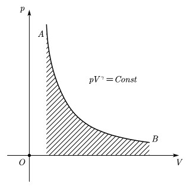

# 一、力学

## （一）流体力学
### 1.理想流体定常流动

- **连续性方程**
$$\huge S_1v_1=S_2v_2=\displaystyle\sum_{i=1}^{n}S_iv_i=Const$$

- **伯努利方程**
$$\huge p+\rho gh+\dfrac{1}{2}\rho v^2=Const$$
> $p$：压强  $\rho gh$：重力势能相关  $v$：流速

### 2.粘性流体

- **牛顿粘性定律**
$$\huge F=\eta \dfrac{\text{d}v}{\text{d}x}S$$
>$F$：粘性力  $\eta$：粘度  $\dfrac{\text{d}v}{\text{d}x}$：速度梯度  $S$：分布面积

- **雷诺数**
$$
\huge
Re=\dfrac{\rho vr}{\eta},
\begin{cases}
层流, & Re<1000\\
过度流, & 1000<Re<1500\\
湍流, & Re>1500
\end{cases}
$$
>$r$：流管半径

- **伯努利方程**
$$\huge p_1+\rho gh_1+\dfrac{1}{2}\rho v_1^2=p_2+\rho gh_2+\dfrac{1}{2}\rho v_2^2+W$$
>$W$：流动中克服粘性阻力做的功

- **泊肃叶定律**
$$\huge q_v=\dfrac{\pi R^4}{8\eta L}(p_1-p_2)$$
>$q_v$：体积流量  $(p_1-p_2)$：压强梯度  $L$：流管长  $R$：流管半径
$$\huge q_v=\dfrac{\Delta p}{R_f}, R_f=\dfrac{8\eta L}{\pi R^4}$$
>$R_f$：流阻  串联：$\large R_f=\displaystyle\sum R_{f_i}$  并联：$\large\dfrac{1}{R_f}=\displaystyle\sum\dfrac{1}{R_{f_i}}$

- **斯托克斯定律**
半径为$r$的小球在粘性流体中所受的阻力为
$$\huge F_f=6\pi \eta rv$$

## （二）狭义相对论

### 1.相对论效应

$$\huge \beta=\dfrac{v}{c}, \gamma=\dfrac{1}{\sqrt{1-\beta^2}}$$
- **时间延缓效应**
$$\huge t=\gamma \tau$$
- **长度收缩效应**
$$\huge L=\dfrac{L_0}{\gamma}$$
### 2.洛伦兹变换
设$S'$系相对于$S$系沿$x$轴正向以速度$v$运动，则有

- **坐标变换**
$$
\huge
\begin{cases}
x'=\gamma(x-vt)\\
y'=y\\
z'=z\\
t'=\gamma(t-\beta\dfrac{x}{c})
\end{cases}
$$
- **速度变换**
$$
\huge
\begin{cases}
u'_x=\dfrac{u_x-v}{1-\dfrac{v}{c^2}u_x}\\
u'_y=\dfrac{u_y}{1-\dfrac{v}{c^2}u_x}\\
u'_z=\dfrac{u_z}{\gamma(1-\dfrac{v}{c^2}u_z)}
\end{cases}
$$

### 3.相对论动力学
- **动质量**
$$\huge m=\gamma m_0$$
- **动量**
$$\huge p=mu=\gamma m_0u$$
- **动能**
$$\huge E_k=mc^2-m_0c^2=E-E_0$$
- **总能量**
$$\huge E=mc^2$$
- **静能**
$$\huge E_0=m_0c^2$$
- **动量能量关系**
$$\huge E^2=p^2c^2+m_0^2c^4$$

# 二、热学

## （一）气体动理论

### 1.状态方程

$$\huge pV=\nu RT\quad or\quad pV=nkT$$
>$R=8.31J/(mol\cdot K)\quad k=\dfrac{R}{N_A}=1.38\times10^{-23}J/K$

### 2.自由度

<table align="center" style="width:100%; text-align: center; vertical-align: middle;">
<tr>
<th colspan="2">自由度种类</th>
<th>平动t</th>
<th>转动r</th>
<th>振动s</th>
<th>总自由度i(t+r+s)</th>
</tr>
<tr>
<th colspan="2">单原子分子</th>
<th>3</th>
<th>0</th>
<th>0</th>
<th>3</th>
</tr>
<tr>
<td rowspan="2">双原子</td>
<td>刚性</td>
<td>3</td>
<td>2</td>
<td>0</td>
<td>5</td>
</tr>
<tr>
<td>非刚性</td>
<td>3</td>
<td>2</td>
<td>1</td>
<td>6</td>
</tr>
<tr>
<td rowspan="2">多原子</td>
<td>刚性</td>
<td>3</td>
<td>3</td>
<td>0</td>
<td>6</td>
</tr>
<tr>
<td>非刚性</td>
<td>3</td>
<td>3</td>
<td>3n-6</td>
<td>3n</td>
</tr>
</table>

### 3.能量均分定理

**定理**  单个气体分子在每个自由度上的能量均为$\dfrac{1}{2}kT$

- **一个分子的平均总动能**
$$\huge \overline{\varepsilon_k}=\dfrac{i}{2}kT$$
- **一个分子的平均总能量**
$$\huge \overline{\varepsilon}=\dfrac{i+s}{2}kT=\dfrac{1}{2}(t+r+2s)kT$$
- **气体内能**
$$\huge E=\dfrac{\nu}{2}(i+s)RT$$

### 4.麦克斯韦速率分布

$$\huge f(v)=\dfrac{\text{d}N_v}{N\text{d}v}=4\pi v^2\left(\dfrac{m_f}{2\pi kT}\right)^{3/2}e^{-\frac{m_fv^2}{2kT}}$$
- **平均速度**
$$\huge \overline{v}=\dfrac{\displaystyle\int_0^\infty v\text{d}N_v}{N}=\sqrt{\dfrac{8RT}{\pi M}}$$
- **均方根速率**
$$\huge \sqrt{\overline{v^2}}=\sqrt{\dfrac{\displaystyle\int_0^\infty v^2\text{d}N_v}{N}}=\sqrt{\dfrac{3RT}{M}}$$
- **最概然速率**
$$\huge \dfrac{\text{d}f{v}}{\text{d}v}\Big|_{v=v_p}=0$$
$$\huge v_p=\sqrt{\dfrac{2RT}{M}}$$
### 5.平均碰撞频率与平均自由程

- **平均碰撞频率**
$$\huge \overline{Z}=\dfrac{n\pi d^2\overline{u}\Delta t}{\Delta t}=n\pi d^2 \overline{u}=\sqrt{2}n\pi d^2\overline{v}$$
>平均相对速率$\overline{u}=\sqrt{2}\overline{v}$

- **平均自由程**
$$\huge \overline{\lambda}=\dfrac{\overline{v}}{\overline{Z}}=\dfrac{1}{\sqrt{2}n\pi d^2}=\dfrac{kT}{\sqrt{2}\pi d^2p}$$
### 6.输运现象

- **粘性现象（动量的输运）**
$$\huge \text{d}F=-\eta \dfrac{\text{d}u}{\text{d}y}\text{d}S$$
>$\text{d}F$：粘性力  $\text{d}S$：面积  $\dfrac{\text{d}u}{\text{d}y}$：速度梯度
>粘度$\eta=\dfrac{1}{3}nm_f\overline{v}\overline{\lambda}$

- **热传导（能量的输运）**
$$\huge \text{d}Q=-\kappa \dfrac{\text{d}T}{\text{d}y}\text{d}S\text{d}t$$
>$\text{d}Q$：通过高度$y$处面积$\text{d}S$传递的热量  $\dfrac{\text{d}T}{\text{d}y}$：温度梯度
>热导率$\kappa=\dfrac{1}{3}nm_f\overline{v}\overline{\lambda}\dfrac{C_{V,m}}{M}$

- **扩散（质量的输运）**
$$\huge \text{d}m=-D\dfrac{\text{d}\rho}{\text{d}y}\text{d}S\text{d}t$$
>$\text{d}m$：通过高度$y$处面积$\text{d}S$扩散的质量  $\dfrac{\text{d}\rho}{\text{d}y}$：密度梯度
>扩散系数$D=\dfrac{1}{3}\overline{v}\overline{\lambda}$

## （二）热力学

- **热力学第一定律** $$\huge Q=A+\Delta E$$
>$Q$从外界吸收的热量  $A$对外界做的功  $\Delta E$内能变化

微分形式
$$\huge \nu C_m\text{d}T=p\text{d}V+\text{d}E$$
### 1.热容

- **摩尔定容热容**
$$\huge C_{V,m}=\dfrac{1}{2}(i+s)R$$
- **迈耶公式**
$$\huge C_{p,m}=C_{V,m}+R=\dfrac{1}{2}(i+s+2)R$$
- **摩尔热容比**
$$\huge \gamma=\dfrac{C_{p,m}}{C_{V,m}}=1+\dfrac{R}{C_{V,m}}=1+\dfrac{2}{i+s}$$

### 2.准静态过程

>对任意过程都有$$\huge \Delta E=\nu C_{V,m}\Delta T$$

- **等容过程**

$$\huge A=0$$
$$\huge \Delta E=Q=\nu C_{V,m}\Delta T$$

- **等压过程**

$$\huge A=p\Delta V=\nu R\Delta T$$
$$\huge Q=\nu C_{p,m}\Delta T$$
$$\huge \Delta E=Q-A=\nu C_{V,m}\Delta T$$
- **等温过程**

$$\huge \Delta E=0$$
$$\huge A=\nu RT \ln{\dfrac{V_2}{V_1}}=\nu RT \ln{\dfrac{p_1}{p_2}}$$
$$\huge Q=A$$
- **绝热过程**

$$\huge Q=0$$
$$\huge A=\dfrac{p_1V_1-p_2V_2}{\gamma -1}$$
$$\huge A=-\Delta E=-\nu C_{V,m}\Delta T$$
- **循环过程——热机效率**
$$\huge \eta=\dfrac{A}{Q_1}=1-\dfrac{Q_2}{Q_1}$$
>$A$系统对外做功  $Q_1$吸热  $Q_2$放热

- **卡诺循环**

